# PJ2 实验报告

## 1、基本信息

- 姓名：贾子安

- 学号：18307130017

- 访问地址：<a href="123.57.244.164/index.html">123.57.244.164/index.html</a>(由于域名jimmyok.site的备案迟迟没有批下来，暂时无法通过域名访问)
- **网站无加密，勿输入任何个人信息**
---------------------------

## 2、项目完成情况

### 2.0 技术选择


- 前端：原生html、css、js，JQuery库。
- 后端：原生php
- 数据库：MariaDB
- 前端和后端的交互主要使用JQuery的ajax实现。
  
---------------------------

### 2.1 登录页、注册页

- 注册页
  - 前端增加*各字段*是否为空的检查
  - 前端增加*邮箱*、*密码*格式合法性检查
  - 前端增加*密码*安全性、*两次密码*是否匹配检查
  - 后端增加*用户名*、*邮箱*存在性检查
  - 注册时实现密码**哈希加盐**，注册时输入的密码与盐拼接后通过SHA256哈希加密后存储于数据库中。
  - 盐通过加密随机数实现并同样存储于数据库，当用户登录时取出盐值与用户输入的密码拼接后哈希，如果和数据库中存储的密码匹配则成功登录。
  - 注册成功一秒后跳转到*登陆界面*。
  - 增加*以游客身份登录*选项，在游客身份下不需要登录，但是不能访问详情页、我的照片、我的收藏页。
  <div align=center>
    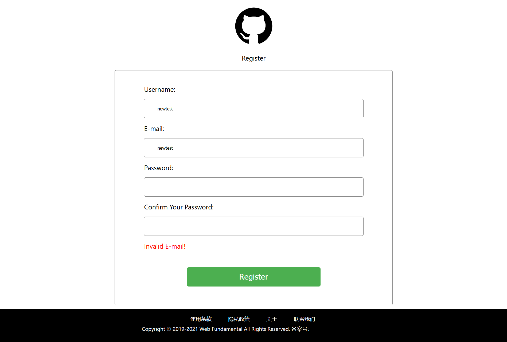
    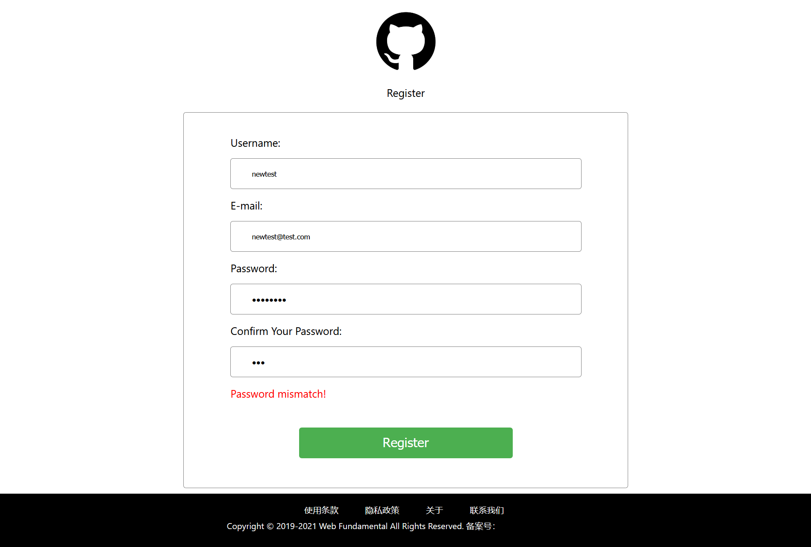
    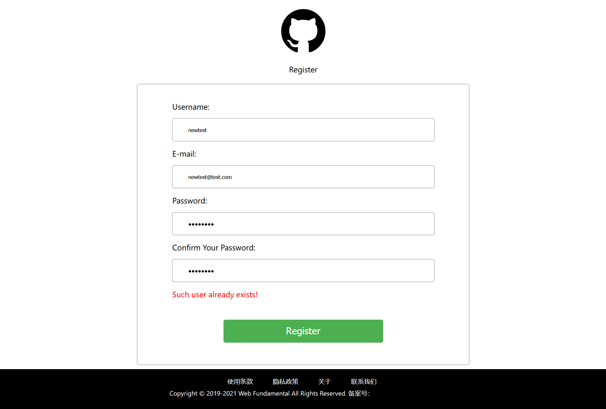
  </div>
---------------------------  
- 登录页
  - 可以通过*用户名*或者*邮箱*登录。 
  - 前端增加对*用户名*、*密码*填写是否为空的检查。
  - 后端增加登录功能，使用php的`session`存储登录状态。
  <div align=center>
    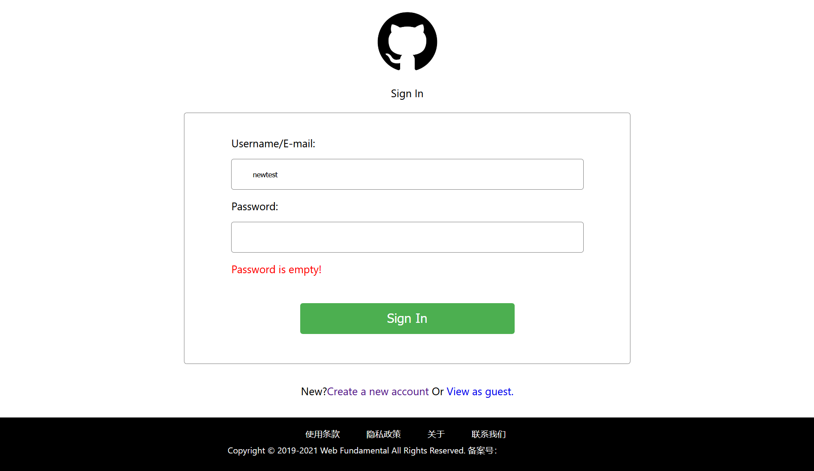
    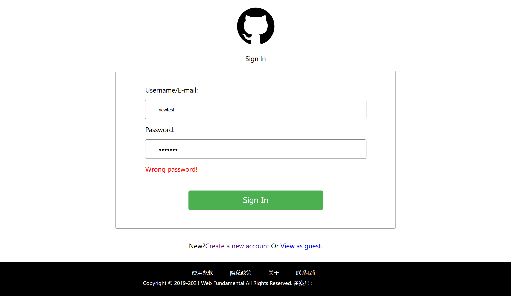
  </div>

---------------------------  

### 2.2 首页
- 大图展示改为轮播区。
- 页面加载完成后与服务器交互，获取*登录信息*。
  - 根据登录状态的不同设置下拉菜单为`登录`还是`个人中心`。
  - `个人中心`中*登录*功能改为*登出*。 
- 页面加载完成后从服务器获取前十张最受欢迎的图片，其中前四张展示于轮播区，其中没有描述的图片自动显示"No description"。
  <div align=center></div>
- 点击刷新按钮后随机选取十张图片代替上述图片的位置。
  <div align=center></div>

---------------------------

### 2.3 浏览页

- 页面加载完成后与服务器交互，获取*总收藏人数前五的国家、地区和主题*并置于侧边栏内。
- 页面加载完成后与服务器交互，获取*所有可选的国家、地区和主题*并置于筛选下拉菜单内。、
  <div align=center>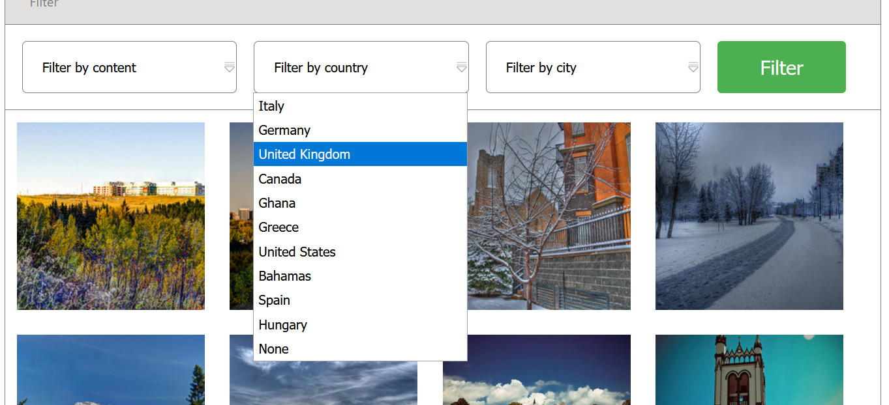</div>
- 点击侧边栏内的筛选条件可以直接选出相应图片
- 通过筛选栏和搜索框也能够筛选出相应图片
- 根据图片搜索结果数量，显示在不同的页内；可以通过底部页码选择要浏览的图片页。
- 如果页面数大于5，则页码按钮只显示五个
- 但是能通过左右箭头按钮实现浏览无法用页码按钮到达的页面——*比如我正在浏览第五页，底部页码按钮则是<< 1 2 3 4 5 >>，此时我按下右箭头，如果第六页存在的话，便切换到第六页，同时底部页码按钮变为<< 2 3 4 5 6 >>，左箭头同理*
  <div align=center></div>


---------------------------

### 2.4 搜索页

- 增加了对待查询标题或者描述是否为空的检查
- 增加了一个消息框，提醒搜索结果。
  <div align=center>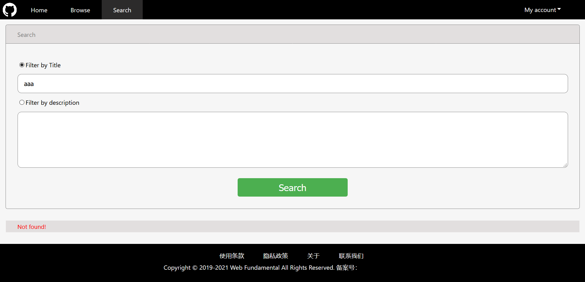</div>
- 搜索结果将会以每页四个的形式展现，如果没有搜到，不显示结果仅出现消息框提示。
- 如果页面数大于**8**，则页码按钮只显示**八个**
  <div align=center>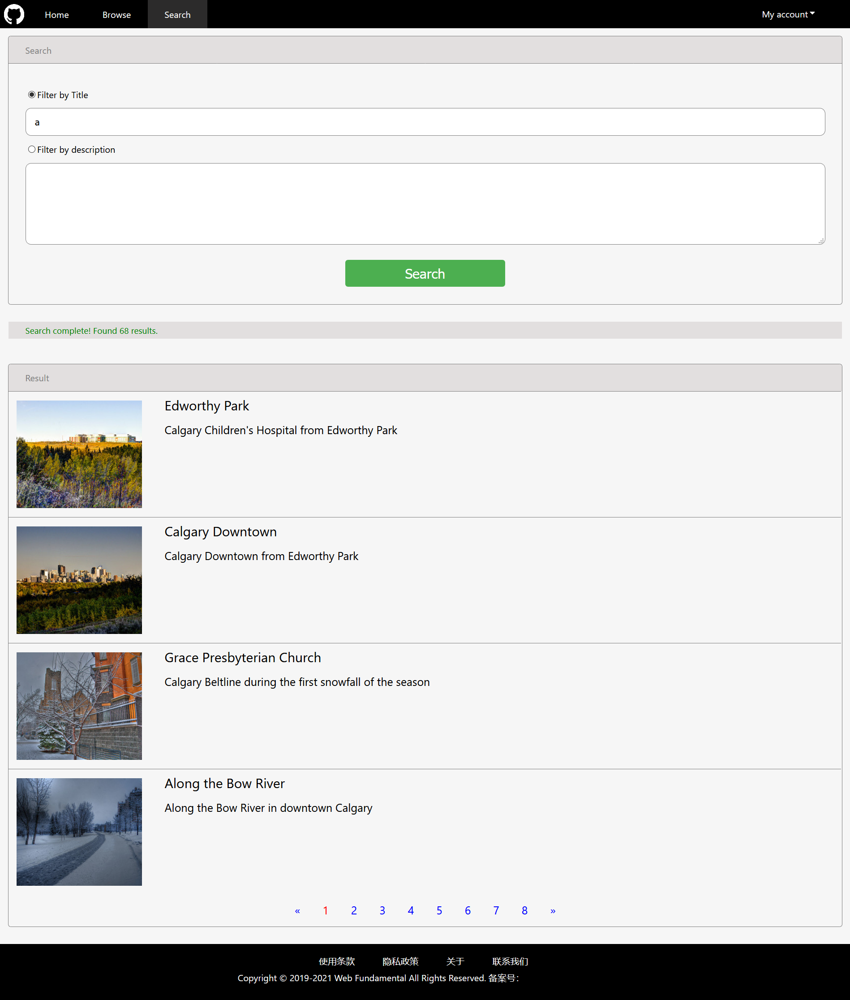</div>
---------------------------

### 2.5 我的图片、我的收藏页

- 文档加载完后先与服务器交互，获取当前登录用户信息，如果没有登录则跳转到登陆界面。
- 如果已经登录则获取当前账号所上传(收藏)的所有照片信息，以与*2.4搜索页*相似的规则展示出来。
- 删除按钮将会与服务器交互，从数据库中删除所上传(收藏)的图片信息。
- 修改按钮将会跳转到上传界面，同时在url查询字符串中加入当前图片的信息供查询页调用。
  <div align=center>
    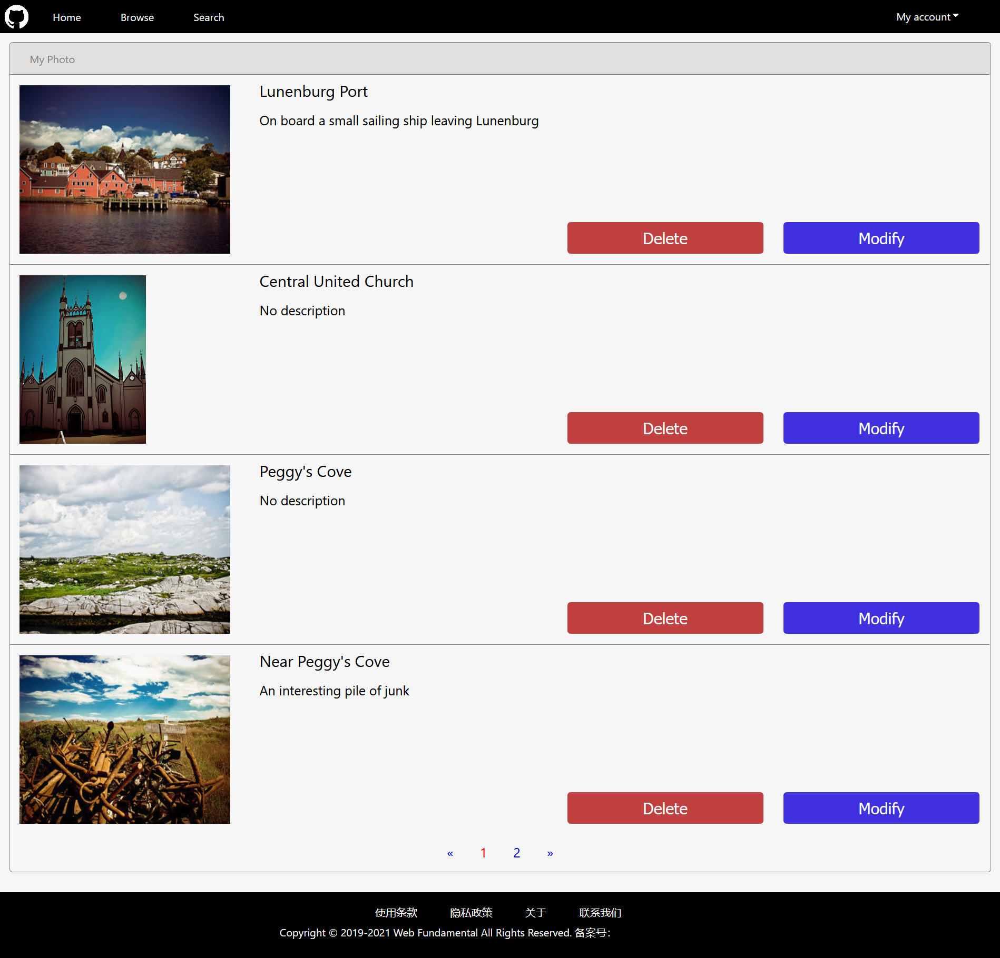
    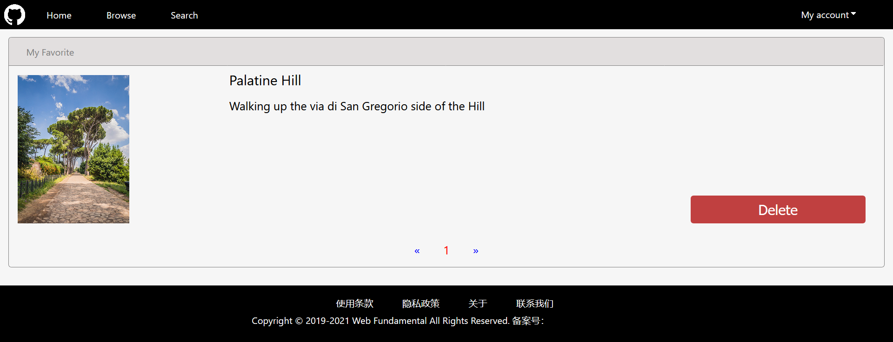
  </div>

---------------------------

### 2.6 上传页面

- 前台、后台加入对输入信息的检查
- 图片内容、国家和地区改为下拉菜单选择，其中内容类别限于`Scenery`,`City`,`People`,`Animal`,`Building`,`Wonder`,`Other`七个类别，国家和地区下拉菜单具有联动。
- 解析自身url，如果带有图片信息，说明是更新图片，从服务器中获得图片信息注入表单中。
- 修改的图片上传到服务器后将会覆盖原图片。
  <div align=center>
    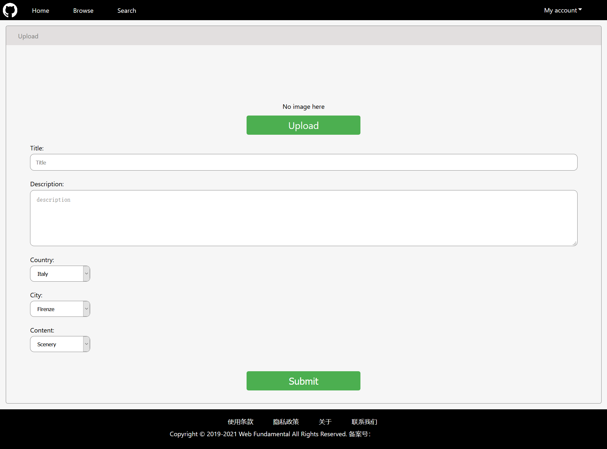
    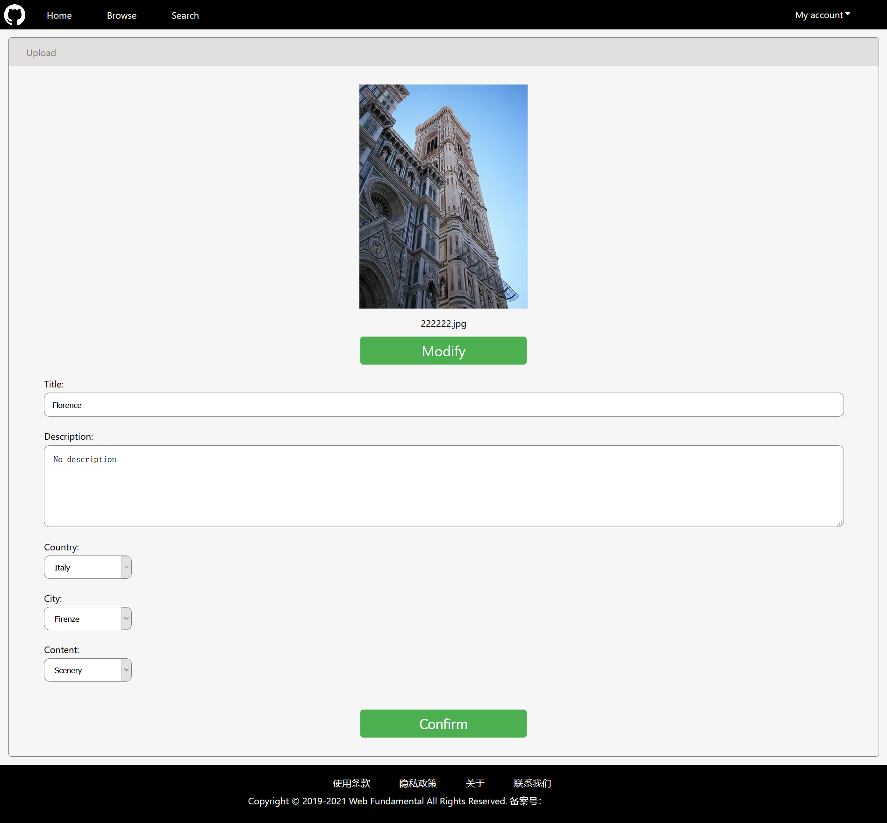
  </div>

---------------------------

### 2.7 详情界面

- 上述所有界面中的图片点击后都会跳转到此，同时在url的查询字符串内加入图片path信息，*如details.html?path=222223.jpg*。
- 解析自身url，从服务器中获取相应图片的资料，展示在各个内容部分里。
- 收藏按钮可以实现在收藏与不收藏的状态之间切换。
  <div align=center>
    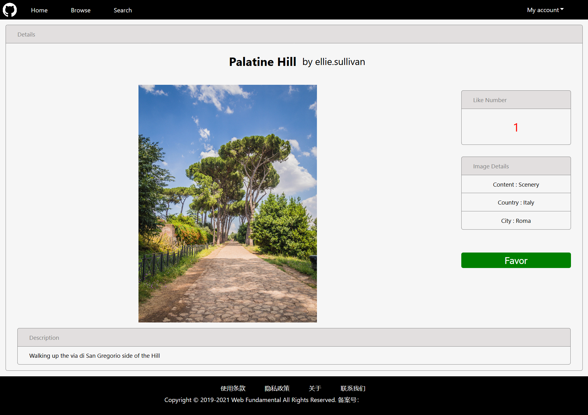
    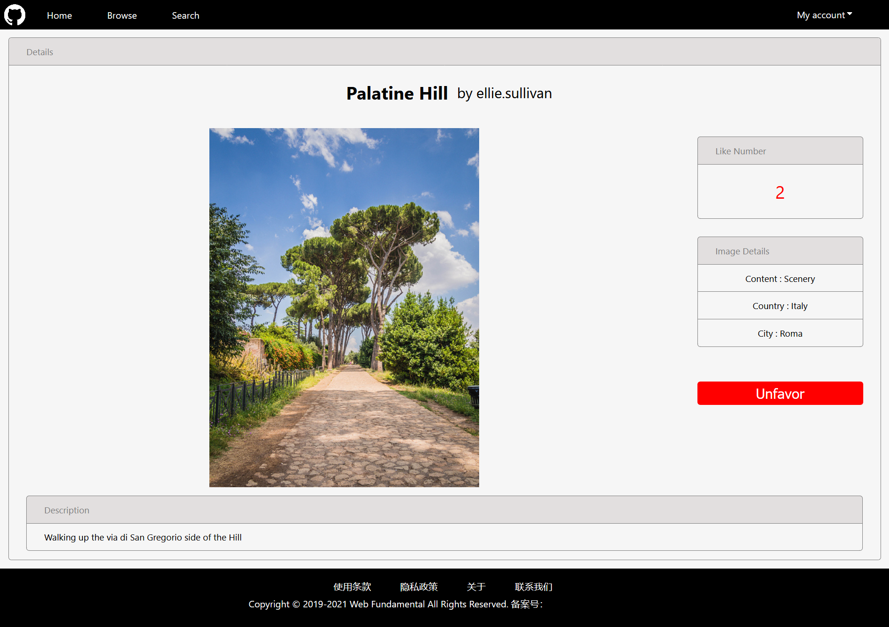
  </div>

---------------------------

## 3、Bonus完成情况

### 3.1 密码哈希加盐存储

- 实现方式：
  - 在数据库表格traveluser中新增一列`Salt`存储该用户注册时随机生成的盐。
  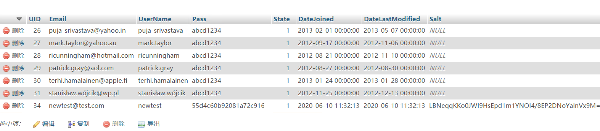
  >其中没有salt的用户数据将会很快删除
  - 在用户注册时取一个32位随机数并进行BASE64加密得到*盐*存入数据库的`Salt`列，再将此盐和用户输入的密码拼接，得到`$hashed_password`存入数据库的`Pass`列。
  ```php
  $salt=base64_encode(random_bytes(32));
  $register_password=hash("sha256",$password.$salt);
  ...
  $sql="INSERT INTO traveluser (email,username,pass,state,datejoined,datelastmodified,salt)
                                VALUES 
  ('$email','$username','$register_password',1,'$time','$time','$salt');";
  mysqli_query($mysqli,$sql); 
  ```
  - 在用户登录时首先取出数据库中对应的盐，与用户输入的密码拼接后执行SHA256哈希函数，得到`$hashed_password`，接着从数据库中取出对应用户的pass(*也就是当他注册时获得的`$hashed_password`*)，将两者比较，如果相同则密码正确。
  ```php
  $result = $mysqli->query("SELECT pass,username,uid FROM traveluser WHERE username='$username' OR email='$username';");
  ...
  $row = mysqli_fetch_assoc($result);
  $result->close();
  $result1 = $mysqli->query("SELECT salt FROM traveluser WHERE username='$username' OR email='$username';");
  $salt = mysqli_fetch_assoc($result1);
  ...
  $hashed_password=hash("sha256",$password.$salt['salt']);
  $result1->close();
  if($row['pass']==$hashed_password){
    ...
  }
  ```

---------------------------

### 3.2 服务器部署

- (免费)租了一台阿里云服务器，在上面安装XAMPP，设置路径、开放合适的安全组后即可通过外网ip地址访问。
- 域名绑定了服务器ip，但是服务器在国内，没备案访问会被拦截，备案*敬请期待*。
  <div align=center>
    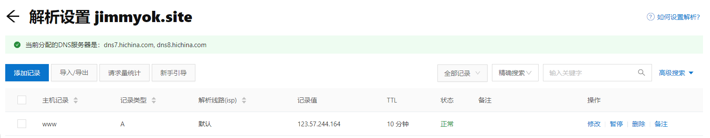
    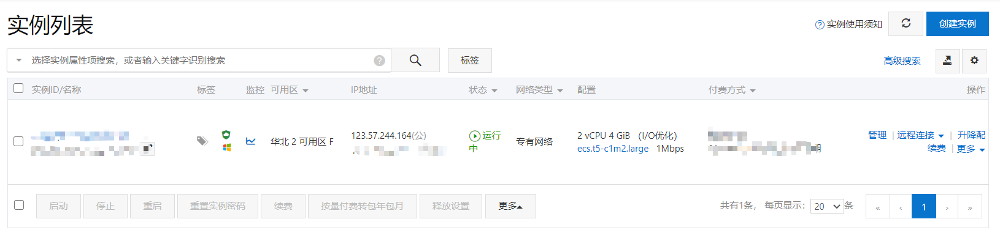
  </div>
---------------------------

## 4. 参考文献

<a href="https://github.com/fudansswebfundamental">fudansswebfundamental</a>

<a href="https://www.w3school.com.cn/">W3school</a>

<a href="https://www.runoob.com/">菜⻦教程</a>

<a href="https://www.iconfont.cn/">阿⾥巴巴⽮量图标库</a>


        

      

